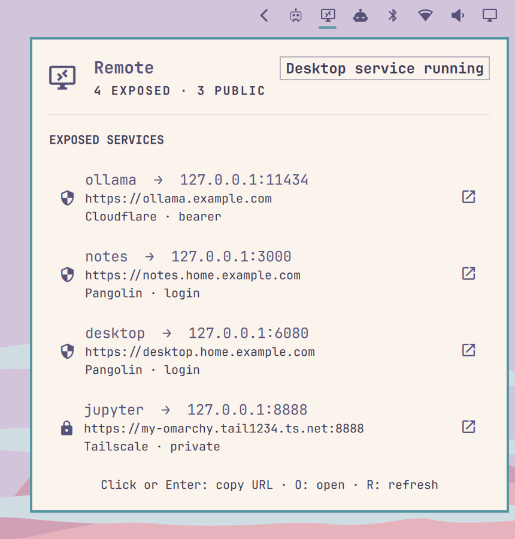

# Omarchy Remote — Omarchy shell plugin



A bar icon and panel for [omarchy-remote](https://github.com/second-state/omarchy-remote): it
lists every service the machine exposes (Tailscale, Pangolin, Cloudflare) with its URL,
provider and auth mode, and lets you copy or open each URL. The icon is dimmed when nothing
is exposed.

The plugin only runs `~/.local/bin/omarchy-remote list --json` (every 60 s by default, and
when the panel opens). It needs no privileges and never changes anything; exposing and
removing services stays in the CLI.

## Install

Install the CLI first (see [omarchy-remote](https://github.com/second-state/omarchy-remote)),
then:

```bash
omarchy plugin add https://github.com/second-state/omarchy-remote-plugin --enable
```

## Use

- Click the icon to open the panel; right-click refreshes.
- In the panel: click a row (or Enter) copies its URL; the arrow button (or `O`) opens it;
  `R` refreshes.
- Scripts and tests can read the plugin's state, even while the screen is locked:
  `qs ipc -p "$OMARCHY_PATH/shell" call omarchy-remote state`

If the CLI isn't installed, the panel says so instead of showing an empty list.

## Configure

One setting, `refreshIntervalSec` (15–3600, default 60): how often the list is refreshed in
the background. Change it from Omarchy's bar settings for this widget.

## Remove

```bash
omarchy plugin remove io.github.second-state.omarchy-remote
```

This removes only the bar widget. The CLI and anything you exposed with it are untouched —
use `omarchy-remote unexpose <name>` / `omarchy-remote uninstall` for those.

## Dependencies and privileges

- Runs unsandboxed inside the Omarchy shell, with your user's permissions, like every
  Omarchy plugin.
- Executes only: `~/.local/bin/omarchy-remote list --json`, `wl-copy <url>` and
  `xdg-open <url>` (both ship with Omarchy). No network access of its own, no files written.

## Develop

```bash
omarchy plugin validate .
```

License: MIT.
